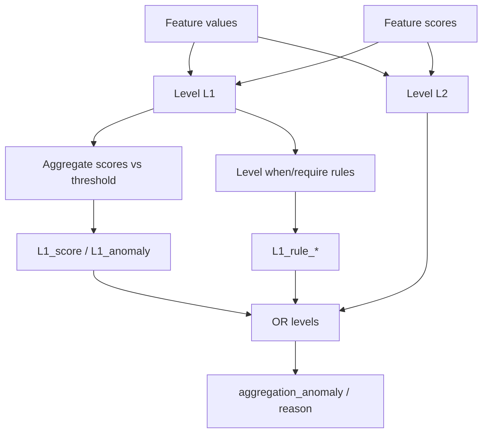

# 📦 AggregationLevelLayer

<div class="layer-hero">
  <div class="layer-hero-content">
    <h1>📦 AggregationLevelLayer</h1>
    <div class="layer-badges">
      <span class="badge badge-advanced">🔴 Advanced</span>
      <span class="badge badge-stable">✅ Stable</span>
    </div>
  </div>
</div>

## 🎯 Overview

The `AggregationLevelLayer` groups features into **logical aggregation levels** (for example `lengths`, `pricing`, `sensor_block`). For each level it can:

1. **Aggregate** per-feature statistical scores (`mean` / `max` / `min` / `sum`) and compare to a level threshold
2. **Evaluate** optional when/require **rules** scoped to that level
3. Emit **per-level** and **global** `aggregation_*` outputs

Call signature: `layer(inputs, feature_stats=None)` — pass `feature_stats` as a **keyword** argument so Keras does not treat it as `training`.

## 🔍 How It Works



Per level, the statistical anomaly (`{level}_anomaly`) stays **stats-only**. Global `aggregation_anomaly` ORs statistical and rule anomalies across levels.

## 💡 Why Use This Layer?

| Challenge | Traditional Approach | This Layer's Solution |
|-----------|---------------------|----------------------|
| **Feature groups** | Flat global score | Named levels with local thresholds |
| **Group rules** | Separate validators | Level-scoped when/require |
| **Explainability** | Single opaque flag | Per-level reasons + global OR |
| **Reuse scores** | Recompute | Consume upstream `feature_stats` |

## 📊 Use Cases

- Product attribute blocks (dimensions, prices, ratings)
- Sensor banks where a mean spike across channels matters
- Hierarchical QC: feature → level → global
- Combining with `FeatureSpaceAnomalyDetectionModel` via `aggregation_levels=`

## 🚀 Quick Start

```python
import keras
from kerasfactory.layers import AggregationLevelLayer

feature_types = {
    "length": "numerical",
    "width": "numerical",
    "color": "categorical",
}

aggregation_levels = {
    "dimensions": {
        "features": ["length", "width"],
        "stats": {
            "aggregation_function": "mean",
            "threshold": 2.0,
        },
        "rules": {
            "positive_dims": {
                "conditions": [
                    {
                        "when": {"color": "red"},
                        "require": {
                            "length": [(">", 0.0)],
                            "width": [(">", 0.0)],
                        },
                    }
                ]
            }
        },
    }
}

layer = AggregationLevelLayer(
    aggregation_levels=aggregation_levels,
    feature_types=feature_types,
)

inputs = {
    "length": keras.ops.convert_to_tensor([[10.0]]),
    "width": keras.ops.convert_to_tensor([[5.0]]),
    "color": keras.ops.convert_to_tensor([["red"]]),
}
feature_stats = {
    "length": keras.ops.convert_to_tensor([[1.0]]),
    "width": keras.ops.convert_to_tensor([[3.5]]),
}

out = layer(inputs, feature_stats=feature_stats)
print(out["dimensions_score"])
print(out["aggregation_anomaly"])
```

## 🔧 Advanced Usage

### Aggregation Functions

`stats.aggregation_function` may be `"mean"`, `"max"`, `"min"`, or `"sum"`. A level without `stats` still emits zeroed score tensors and can run rules only.

### Feature Ownership

Each feature may belong to **at most one** aggregation level. Overlaps raise `ValueError` during init.

### Model Integration

```python
from kerasfactory.models import FeatureSpaceAnomalyDetectionModel

model = FeatureSpaceAnomalyDetectionModel(
    feature_space={"length": "numerical", "width": "numerical"},
    aggregation_levels={
        "dimensions": {
            "features": ["length", "width"],
            "stats": {"aggregation_function": "max", "threshold": 2.5},
        }
    },
)
```

The model passes per-feature merged scores into this layer automatically.

## 📖 API Reference

::: kerasfactory.layers.AggregationLevelLayer

## 🔧 Parameter Guide

### `aggregation_levels` (dict)
Each level:

| Key | Required | Description |
|-----|----------|-------------|
| `features` | yes | Non-empty feature list (exclusive ownership) |
| `stats` | no | `aggregation_function`, `threshold` |
| `rules` | no | Named when/require rules (same schema as multi-feature) |

### `feature_types` (dict)
`"numerical"` or `"categorical"` for every referenced feature.

## 📈 Key Outputs

| Pattern | Meaning |
|---------|---------|
| `{level}_score` / `_proba` / `_anomaly` / `_reason` | Level statistical aggregation |
| `{level}_rule_score` / `_rule_anomaly` / `_rule_reason` | Level rule branch |
| `aggregation_*` | Global OR across levels |
| `aggregation_levels` | Level name list |

## 🧪 Testing

```bash
pytest tests/layers/test__AggregationLevelLayer.py -v
```

## ⚠️ Common Issues

| Issue | Cause | Fix |
|-------|-------|-----|
| Feature in two levels | Overlapping `features` | Assign exclusive ownership |
| `feature_stats` ignored | Positional arg | Use `feature_stats=...` keyword |
| Missing feature | Not in `inputs` | Provide every level feature |
| No score effect | Empty `feature_stats` | Pass upstream scores |

## 🔗 Related Layers / Models

- [MultiFeatureBusinessRulesLayer](multi-feature-business-rules-layer.md)
- [StatisticalNumericalAnomalyDetection](statistical-numerical-anomaly-detection.md)
- [GlobalAnomalyMergeLayer](global-anomaly-merge-layer.md)
- [FeatureSpaceAnomalyDetectionModel](../models/feature-space-anomaly-detection-model.md)

## 📚 Further Reading

- [KerasFactory Layer Explorer](../layers_overview.md)
- StatsAnomaly `fixed_aggregation_level_layer` (upstream source for this port)
