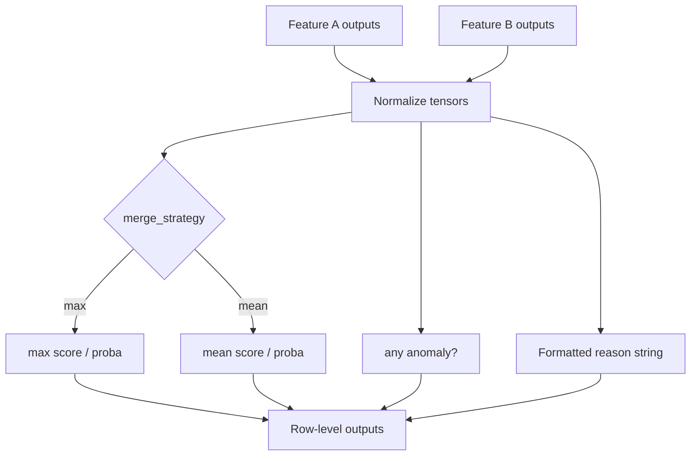

# 🔗 GlobalAnomalyMergeLayer

<div class="layer-hero">
  <div class="layer-hero-content">
    <h1>🔗 GlobalAnomalyMergeLayer</h1>
    <div class="layer-badges">
      <span class="badge badge-beginner">🟢 Beginner</span>
      <span class="badge badge-stable">✅ Stable</span>
    </div>
  </div>
</div>

## 🎯 Overview

The `GlobalAnomalyMergeLayer` combines **per-feature** anomaly dictionaries into a single **row-level** prediction. It aggregates probabilities and scores with a `max` or `mean` strategy, ORs anomaly flags across features, and builds a combined human-readable `reason` string.

This is the final merge step used by `FeatureSpaceAnomalyDetectionModel`.

## 🔍 How It Works

1. Accept a dict of feature name → anomaly outputs (`proba`/`probability`, `score`, `anomaly`/`is_anomaly`, `reason`)
2. Skip aggregation metadata keys (`aggregation_levels`, keys starting with `aggregation_`)
3. Stack feature tensors and reduce with `max` or `mean`
4. Mark the row anomalous if **any** feature is anomalous
5. Concatenate formatted feature reasons for anomalous features



## 💡 Why Use This Layer?

| Challenge | Traditional Approach | This Layer's Solution |
|-----------|---------------------|----------------------|
| **Many feature scores** | Manual reduction | Built-in `max` / `mean` |
| **Explainability** | Opaque aggregate | Combined reason strings |
| **Heterogeneous keys** | Brittle glue code | Accepts `proba` or `probability`, etc. |
| **Aggregation noise** | Accidental merge of meta keys | Skips `aggregation_*` keys |

## 📊 Use Cases

- Final row-level decision after per-feature detectors
- Dashboards that need one probability and one reason per row
- Combining statistical, business-rule, and multi-feature branches
- Serving APIs that expect flat `probability` / `is_anomaly` / `reason`

## 🚀 Quick Start

```python
import keras
from kerasfactory.layers import GlobalAnomalyMergeLayer

layer = GlobalAnomalyMergeLayer(merge_strategy="max", format_details=True)

feature_outputs = {
    "temperature": {
        "proba": keras.ops.convert_to_tensor([[30.0]]),
        "score": keras.ops.convert_to_tensor([[1.5]]),
        "anomaly": keras.ops.convert_to_tensor([[False]]),
        "reason": keras.ops.convert_to_tensor([["Value within statistical range"]]),
    },
    "color": {
        "proba": keras.ops.convert_to_tensor([[100.0]]),
        "score": keras.ops.convert_to_tensor([[2.0]]),
        "anomaly": keras.ops.convert_to_tensor([[True]]),
        "reason": keras.ops.convert_to_tensor([["Unknown category"]]),
    },
}

out = layer(feature_outputs)
print(out.keys())
# probability, score, is_anomaly, reason, details
print(out["is_anomaly"])  # True because color is anomalous
```

## 🔧 Advanced Usage

### Mean Strategy (smoother)

```python
layer = GlobalAnomalyMergeLayer(merge_strategy="mean", format_details=False)
# Quieter reasons (no score suffixes); averages can reduce spike sensitivity
```

### With FeatureSpaceAnomalyDetectionModel

The model already wires this layer as `global_merge`. Prefer configuring features/rules on the model; use the layer directly only when building a custom Functional graph.

### Flat / prefixed inputs

If a feature value is not a dict, the layer looks for sibling keys like `{name}_proba`, `{name}_score`, `{name}_anomaly`, `{name}_reason`.

## 📖 API Reference

::: kerasfactory.layers.GlobalAnomalyMergeLayer

## 🔧 Parameter Guide

### `merge_strategy` (str)
- **Options**: `"max"`, `"mean"`
- **Default**: `"max"`
- **Recommendation**: `"max"` for conservative “any spike wins”; `"mean"` when you want consensus across features

### `format_details` (bool)
- **Default**: `True`
- **Impact**: Appends `(score: …)` fragments to reason strings when `True`

## 📈 Output Keys

| Key | Shape | Description |
|-----|-------|-------------|
| `probability` | `(batch, 1)` | Merged probability |
| `score` | `(batch, 1)` | Merged score |
| `is_anomaly` | `(batch, 1)` | True if any feature is anomalous |
| `reason` | `(batch,)` | Combined explanation |
| `details` | `(batch,)` | Same content as `reason` |

## 🧪 Testing

```bash
pytest tests/layers/test__GlobalAnomalyMergeLayer.py -v
```

## ⚠️ Common Issues

| Issue | Cause | Fix |
|-------|-------|-----|
| Empty / wrong merge | Only `aggregation_*` keys present | Pass real feature dicts |
| Rank errors | Nested feature tensors | Ensure per-feature tensors are `(batch, 1)` |
| Unexpected `True` anomaly | `any` over features | Filter noisy features before merge, or use `mean` |
| Opaque reasons | `format_details=False` | Enable formatting or keep per-feature reasons |

## 🔗 Related Layers / Models

- [StatisticalNumericalAnomalyDetection](statistical-numerical-anomaly-detection.md)
- [MultiFeatureBusinessRulesLayer](multi-feature-business-rules-layer.md)
- [AggregationLevelLayer](aggregation-level-layer.md)
- [FeatureSpaceAnomalyDetectionModel](../models/feature-space-anomaly-detection-model.md)

## 📚 Further Reading

- [Anomaly detection](https://en.wikipedia.org/wiki/Anomaly_detection)
- [KerasFactory Layer Explorer](../layers_overview.md)
