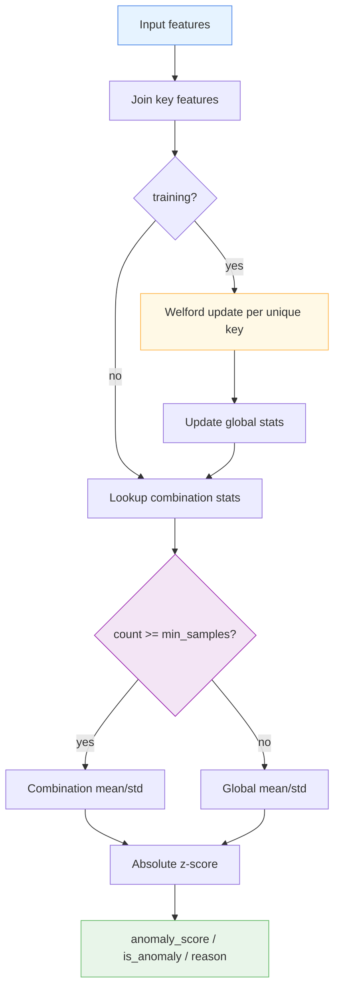

# 📊 GroupStatisticsLayer

<div class="layer-hero">
  <div class="layer-hero-content">
    <h1>📊 GroupStatisticsLayer</h1>
    <div class="layer-badges">
      <span class="badge badge-intermediate">🟡 Intermediate</span>
      <span class="badge badge-stable">✅ Stable</span>
      <span class="badge badge-anomaly">🛰️ Anomaly Detection</span>
    </div>
  </div>
</div>

## 🎯 Overview

The `GroupStatisticsLayer` maintains **online mean / standard deviation / count** for
numerical target features, stratified by categorical key combinations. It scores
each sample with absolute z-scores and falls back to **global** statistics when a
combination has fewer than `min_samples` observations.

Key features are joined per sample (`"|"`-separated). Distinct combinations
(for example `electronics|north` vs `furniture|south`) keep independent running
statistics via Welford's algorithm.

## 🔍 How It Works

1. **Key joining**: Stratification features listed in each group config are joined
   into a per-sample combination key.
2. **Training update**: For every unique key in the batch, Welford-merge target
   values into that combination's mean/std/count; also update global (and
   schema-level) aggregates.
3. **Inference scoring**: For each sample, look up its combination. If
   `count >= min_samples`, use combination stats; otherwise use global stats.
4. **Multi-config order**: When several group configs exist, the first matching
   config in insertion order claims each sample (`processed_mask`).



!!! note "TensorFlow for string ops"
    Numeric Welford / z-score math uses Keras 3 `ops`. String `join`, `unique`,
    and `boolean_mask` use TensorFlow because Keras ops do not yet cover those
    patterns for string tensors.

## 💡 Why Use This Layer?

| Challenge | Traditional Approach | GroupStatisticsLayer's Solution |
|-----------|---------------------|----------------------------------|
| **Cohort drift** | One global threshold | 🎯 **Per-combination** online stats |
| **Sparse groups** | Drop or crash | ⚡ **Global fallback** when under-sampled |
| **Streaming fit** | Refit offline | 🧠 **Welford** updates during `training=True` |
| **Serving** | Custom Python grouping | 🔗 Keras-serializable layer + reasons |

## 📊 Use Cases

- Stratified retail / IoT anomaly detection (store × product cohorts)
- Online baselines per categorical segment
- Fallback-safe scoring for rare or new key combinations
- Building block for `KerasStratifiedAnomalyModel`

## 🚀 Quick Start

### Basic Usage

```python
import keras
from kerasfactory.layers import GroupStatisticsLayer

layer = GroupStatisticsLayer(
    group_configs={
        "store": {"keys": ["store_id"], "threshold": 2.0},
    },
    target_features=["sales"],
    min_samples=2,
)

batch = {
    "store_id": keras.ops.convert_to_tensor(
        ["A", "A", "A", "A"], dtype="string",
    ),
    "sales": keras.ops.convert_to_tensor(
        [10.0, 11.0, 12.0, 100.0], dtype="float32",
    ),
}

_ = layer(batch, training=True)          # update stats
outputs = layer(batch, training=False)   # score

print(outputs["sales"]["anomaly_score"])
print(outputs["sales"]["is_anomaly"])
print(outputs["sales"]["reason"])
```

### Multi-Feature Keys

```python
layer = GroupStatisticsLayer(
    group_configs={
        "product_store": {
            "keys": ["product_category", "store_location"],
            "threshold": 3.0,
        }
    },
    target_features=["sales", "inventory"],
    min_samples=5,
)
```

### With KerasStratifiedAnomalyModel

```python
from kerasfactory.models import KerasStratifiedAnomalyModel

model = KerasStratifiedAnomalyModel(
    feature_space={"store_id": "string", "sales": "float"},
    key_features=["store_id"],
    target_features=["sales"],
    min_samples=5,
    threshold=3.0,
)
```

## 📖 API Reference

::: kerasfactory.layers.GroupStatisticsLayer

## 🔧 Parameters Deep Dive

### `group_configs` (dict)
- **Purpose**: Named stratification schemas
- **Format**: `{name: {"keys": [...], "threshold": float}}`
- **Impact**: Defines which categorical features form combination keys
- **Recommendation**: Start with one schema; add coarser schemas for fallback order

### `target_features` (list[str])
- **Purpose**: Numerical features to score
- **Impact**: Output dictionary keys and statistic vector width
- **Recommendation**: Keep features on comparable scales or transform upstream

### `min_samples` (int)
- **Purpose**: Minimum combination count before trusting local stats
- **Default**: `5`
- **Impact**: Lower → more local sensitivity; higher → more global fallback
- **Recommendation**: Tune from expected cohort sizes

### `fallback_strategy` (str)
- **Purpose**: Behavior when a combination is under-sampled
- **Options**: `"global"` only
- **Impact**: Uses running global mean/std for rare keys

### `epsilon` (float)
- **Purpose**: Numerical stability for std / division
- **Default**: `1e-10`

## 📈 Performance Characteristics

- **Speed**: ⚡⚡⚡ Fast for moderate unique-key cardinality per batch
- **Memory**: 💾 Grows with unique combinations seen during training
- **Accuracy**: 🎯🎯🎯 Strong for stable categorical cohorts
- **Best For**: Stratified tabular / event streams with categorical keys

## 🎨 Examples

### Example 1: Detect store-level sales spikes

```python
import keras
from kerasfactory.layers import GroupStatisticsLayer

layer = GroupStatisticsLayer(
    group_configs={"store": {"keys": ["store_id"], "threshold": 2.5}},
    target_features=["sales"],
    min_samples=3,
)

history = {
    "store_id": keras.ops.convert_to_tensor(
        ["A", "A", "A", "B", "B", "B"], dtype="string",
    ),
    "sales": keras.ops.convert_to_tensor(
        [10.0, 11.0, 9.5, 200.0, 210.0, 190.0], dtype="float32",
    ),
}
_ = layer(history, training=True)

new_day = {
    "store_id": keras.ops.convert_to_tensor(["A", "B"], dtype="string"),
    "sales": keras.ops.convert_to_tensor([55.0, 205.0], dtype="float32"),
}
print(layer(new_day, training=False)["sales"]["is_anomaly"])
```

### Example 2: Inspect combination stats

```python
stats = layer.get_combination_stats()
for combo_id, payload in stats.items():
    print(combo_id, payload["count"], payload["mean"])
```

## 💡 Tips & Best Practices

- Fit with `training=True` in **eager** mode so combination weights can be created
- Set `min_samples` from the smallest cohort you trust
- Cast key features to string (or rely on automatic `as_string`)
- Serialize after training so `combination_stats` land in `get_config`
- Pair with `KerasStratifiedAnomalyModel` for end-to-end stratified serving

## ⚠️ Common Pitfalls

- **Graph-only training**: Dynamic combination weights expect eager updates
- **Cardinality explosion**: Extremely high-cardinality keys grow memory
- **Unseen keys at inference**: New combinations correctly use global fallback
- **Scale mismatch**: Raw z-scores assume roughly comparable feature scales
- **Empty batch**: Returns empty tensors; build the layer with non-empty data first

## 🔗 Related Layers

- [StatisticalNumericalAnomalyDetection](statistical-numerical-anomaly-detection.md) — Non-stratified statistical scoring
- [GlobalAnomalyMergeLayer](global-anomaly-merge-layer.md) — Merge feature-level anomalies
- [BusinessRulesLayer](business-rules-layer.md) — Rule-based validation
- [AggregationLevelLayer](aggregation-level-layer.md) — Level-wise aggregation rules

## 📚 Further Reading

- [Welford's online algorithm](https://en.wikipedia.org/wiki/Algorithms_for_calculating_variance#Welford's_online_algorithm)
- [Z-score](https://en.wikipedia.org/wiki/Standard_score)
- [KerasFactory Layer Explorer](../layers_overview.md)
- [KerasStratifiedAnomalyModel](../models/keras-stratified-anomaly-model.md)
