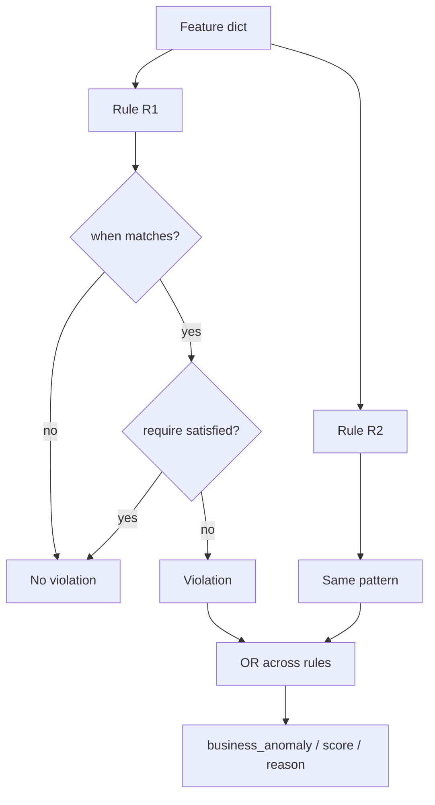

# 📋 MultiFeatureBusinessRulesLayer

<div class="layer-hero">
  <div class="layer-hero-content">
    <h1>📋 MultiFeatureBusinessRulesLayer</h1>
    <div class="layer-badges">
      <span class="badge badge-intermediate">🟡 Intermediate</span>
      <span class="badge badge-stable">✅ Stable</span>
    </div>
  </div>
</div>

## 🎯 Overview

The `MultiFeatureBusinessRulesLayer` evaluates **declarative when/require rules** that span multiple features. When a `when` clause matches, the corresponding `require` constraints must hold; otherwise the sample is flagged as a business-rule anomaly.

Unlike single-feature [`BusinessRulesLayer`](business-rules-layer.md), this layer expresses **conditional cross-feature** logic (for example: “if season is winter, then temperature must be below 15”).

## 🔍 How It Works

1. For each named rule, evaluate every condition
2. A condition **applies** when all `when` feature predicates match
3. A **violation** occurs when the condition applies but any `require` predicate fails
4. Rule violations are OR-ed into a row-level `business_anomaly`
5. Emit `business_*` outputs plus per-rule `rule_violations` / `rule_names`



## 💡 Why Use This Layer?

| Challenge | Traditional Approach | This Layer's Solution |
|-----------|---------------------|----------------------|
| **Cross-feature logic** | Hand-written `if` glue | Declarative when/require schema |
| **Auditable rules** | Buried in code | Named rules with violation matrix |
| **Mixed types** | Separate paths | Numerical + categorical operators |
| **Model integration** | External validation | Keras-serializable layer |

## 📊 Use Cases

- Seasonal or context-dependent constraints
- Compliance / policy checks across related columns
- Enriching statistical detectors with domain rules
- Debugging which named rule fired via `rule_violations`

## 🚀 Quick Start

```python
import keras
from kerasfactory.layers import MultiFeatureBusinessRulesLayer

feature_types = {
    "season": "categorical",
    "temperature": "numerical",
}

rules = {
    "winter_temp": {
        "features": ["season", "temperature"],
        "conditions": [
            {
                "when": {"season": "winter"},
                "require": {"temperature": [("<", 15.0)]},
            }
        ],
    }
}

layer = MultiFeatureBusinessRulesLayer(rules=rules, feature_types=feature_types)

inputs = {
    "season": keras.ops.convert_to_tensor([["winter"], ["summer"]]),
    "temperature": keras.ops.convert_to_tensor([[20.0], [25.0]]),
}
out = layer(inputs)

print(out["business_anomaly"])  # [[True], [False]] — winter+20 violates
print(out["rule_names"])
```

## 🔧 Advanced Usage

### Multiple Conditions and Features

```python
rules = {
    "premium_discount": {
        "features": ["tier", "discount", "region"],
        "conditions": [
            {
                "when": {"tier": "basic", "region": "EU"},
                "require": {"discount": [("<", 0.1)]},
            },
            {
                "when": {"tier": "premium"},
                "require": {
                    "discount": [(">=", 0.0), ("<=", 0.5)],
                },
            },
        ],
    }
}
```

### Operators

**Numerical**: `>`, `<`, `>=`, `<=`, `==`, `!=`  
**Categorical**: `==`, `!=`, `in`, `not in`

`when` values may be bare scalars/strings (implicit `==`) or explicit `(op, value)` pairs.

### Inside FeatureSpaceAnomalyDetectionModel

Pass `multi_feature_rules=...` to the model; it builds this layer and merges outputs under the `multi_feature` key before global merge.

## 📖 API Reference

::: kerasfactory.layers.MultiFeatureBusinessRulesLayer

## 🔧 Parameter Guide

### `rules` (dict)
Each rule entry must include:

- `features`: non-empty list of feature names used by the rule
- `conditions`: non-empty list of `{when, require}` dicts

### `feature_types` (dict)
Maps every referenced feature to `"numerical"` or `"categorical"`. All features in `when`/`require`/`features` must be declared here.

## 📈 Output Keys

| Key | Description |
|-----|-------------|
| `business_score` / `business_proba` | `100` when anomalous, else `0` |
| `business_threshold` | Status string (`"Rules defined"`) |
| `business_anomaly` | Row-level boolean |
| `business_reason` | Which rule description fired |
| `rule_violations` | `(batch, n_rules)` boolean matrix |
| `rule_names` | Rule name strings |

## 🧪 Testing

```bash
pytest tests/layers/test__MultiFeatureBusinessRulesLayer.py -v
```

## ⚠️ Common Issues

| Issue | Cause | Fix |
|-------|-------|-----|
| `undefined feature` | Missing from `feature_types` | Declare every referenced name |
| Missing input key | Feature not in `inputs` | Provide all configured features |
| Always False | `when` never matches | Check dtypes/strings (exact match) |
| Serialization shape | Tuples became lists | Layer accepts both via `_as_rule` |

## 🔗 Related Layers / Models

- [BusinessRulesLayer](business-rules-layer.md) — single-feature rules
- [AggregationLevelLayer](aggregation-level-layer.md) — level-scoped when/require
- [GlobalAnomalyMergeLayer](global-anomaly-merge-layer.md)
- [FeatureSpaceAnomalyDetectionModel](../models/feature-space-anomaly-detection-model.md)

## 📚 Further Reading

- [Business rule](https://en.wikipedia.org/wiki/Business_rule)
- [KerasFactory Layer Explorer](../layers_overview.md)
