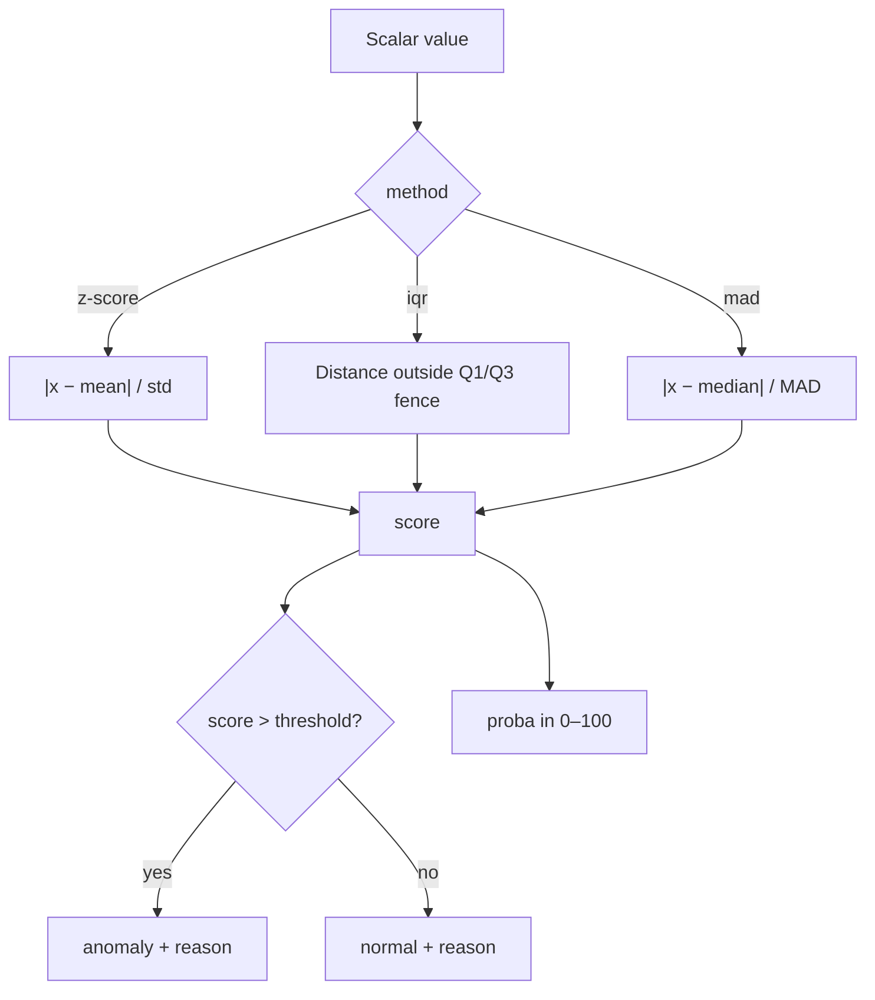

# 📐 StatisticalNumericalAnomalyDetection

<div class="layer-hero">
  <div class="layer-hero-content">
    <h1>📐 StatisticalNumericalAnomalyDetection</h1>
    <div class="layer-badges">
      <span class="badge badge-intermediate">🟡 Intermediate</span>
      <span class="badge badge-stable">✅ Stable</span>
      <span class="badge badge-popular">🔥 Popular</span>
    </div>
  </div>
</div>

## 🎯 Overview

The `StatisticalNumericalAnomalyDetection` layer detects anomalies in a **scalar numerical feature** using classical statistical methods: **z-score**, **IQR (Tukey fences)**, or **MAD (median absolute deviation)**.

Statistics are stored as **non-trainable weights**, so they survive `.keras` save/load. You must call `initialize_from_stats(...)` after construction (or after loading) before meaningful inference.

## 🔍 How It Works

1. **Initialize statistics** for the chosen method (`mean`/`std`, `q1`/`q3`, or `median`/`mad`)
2. **Score** each value against those statistics
3. **Flag anomalies** when the score exceeds `threshold`
4. **Map** the score to a probability in `[0, 100]` and emit a human-readable `reason`



## 💡 Why Use This Layer?

| Challenge | Traditional Approach | This Layer's Solution |
|-----------|---------------------|----------------------|
| **Interpretable scores** | Opaque neural scores | Classic statistical deviation |
| **Persisted baselines** | Recompute offline | Non-trainable weights in the model |
| **Method choice** | One hardcoded rule | Switch `z-score` / `iqr` / `mad` |
| **Explainability** | No reasons | String `reason` per sample |

## 📊 Use Cases

- Baseline / cold-start anomaly detection before training neural detectors
- Feature-level scoring inside `FeatureSpaceAnomalyDetectionModel`
- Robust detection with `iqr` or `mad` when distributions are skewed
- Production pipelines that need serializable statistic thresholds

## 🚀 Quick Start

### Basic Usage (z-score)

```python
import keras
from kerasfactory.layers import StatisticalNumericalAnomalyDetection

layer = StatisticalNumericalAnomalyDetection(method="z-score", threshold=2.0)
layer.initialize_from_stats({"mean": 50.0, "std": 10.0})
# Or: layer.initialize_from_stats(mean=50.0, std=10.0)

x = keras.ops.convert_to_tensor([[55.0], [80.0]])
out = layer(x)

print(out.keys())
# score, proba, threshold, anomaly, reason, value
print(out["anomaly"])  # [[False], [True]] for threshold=2.0
```

### IQR Method

```python
layer = StatisticalNumericalAnomalyDetection(method="iqr", threshold=1.5)
layer.initialize_from_stats({"q1": 40.0, "q3": 60.0})
out = layer(keras.ops.convert_to_tensor([[35.0], [90.0]]))
```

### MAD Method

```python
layer = StatisticalNumericalAnomalyDetection(method="mad", threshold=3.0)
layer.initialize_from_stats({"median": 50.0, "mad": 5.0})
out = layer(keras.ops.convert_to_tensor([[50.0], [70.0]]))
```

## 🔧 Advanced Usage

### In a Functional Model

```python
import keras
from kerasfactory.layers import StatisticalNumericalAnomalyDetection

inputs = keras.Input(shape=(1,), name="temperature")
layer = StatisticalNumericalAnomalyDetection(method="z-score", threshold=2.5)
layer.initialize_from_stats(mean=20.0, std=5.0)
outputs = layer(inputs)

model = keras.Model(inputs, outputs)
preds = model.predict({"temperature": [[18.0], [40.0]]})
```

### Serialization

```python
layer = StatisticalNumericalAnomalyDetection(method="z-score", threshold=2.0)
layer.initialize_from_stats(mean=0.0, std=1.0)

# Weights (including mean/std) persist with the model
cfg = layer.get_config()
restored = StatisticalNumericalAnomalyDetection.from_config(cfg)
restored.build((None, 1))
restored.set_weights(layer.get_weights())
```

## 📖 API Reference

::: kerasfactory.layers.StatisticalNumericalAnomalyDetection

## 🔧 Parameter Guide

### `method` (str)
- **Options**: `"z-score"`, `"iqr"`, `"mad"`
- **Default**: `"z-score"`
- **Recommendation**: Prefer `z-score` for roughly Gaussian data; use `iqr`/`mad` for skewed or outlier-heavy data

### `threshold` (float)
- **Default**: `2.0`
- **Impact**: Higher → fewer anomalies
- **Recommendation**: Start at `2.0`–`3.0` for z-score; `1.5` is classic for IQR fences

### `epsilon` (float)
- **Default**: `1e-8`
- **Purpose**: Safe division when std/IQR/MAD is near zero

### `initialize_from_stats(...)`
Required stats by method:

| Method | Required keys |
|--------|----------------|
| `z-score` | `mean`, `std` |
| `iqr` | `q1`, `q3` |
| `mad` | `median`, `mad` |

Accepts a dict, kwargs, or positional `(mean, std)` for the simple z-score API.

## 📈 Performance Characteristics

- **Speed**: ⚡⚡⚡⚡ Very fast (elementwise ops only)
- **Memory**: 💾 Negligible (six scalar weights)
- **Accuracy**: 🎯 Strong for well-calibrated baselines
- **Best For**: Interpretable per-feature numerical anomaly scoring

## 🧪 Testing

```bash
pytest tests/layers/test__StatisticalNumericalAnomalyDetection.py -v
```

Typical coverage: init validation, each method, `initialize_from_stats` APIs, output shapes/keys, serialization.

## ⚠️ Common Issues

| Issue | Cause | Fix |
|-------|-------|-----|
| All scores ~0 or nonsense | Stats not initialized | Call `initialize_from_stats` |
| Division blow-ups | Near-zero std/MAD | Raise `epsilon` or clamp stats |
| Wrong method stats | Missing keys | Supply the keys for that method |
| Shape mismatch | Multi-feature tensor | Pass `(batch, 1)` or `(batch,)` only |

## 🔗 Related Layers / Models

- [NumericalAnomalyDetection](numerical-anomaly-detection.md) — learned autoencoder + distribution scoring
- [CategoricalAnomalyDetectionLayer](categorical-anomaly-detection-layer.md) — categorical membership
- [GlobalAnomalyMergeLayer](global-anomaly-merge-layer.md) — merge feature scores to row level
- [FeatureSpaceAnomalyDetectionModel](../models/feature-space-anomaly-detection-model.md) — full feature-space model

## 📚 Further Reading

- [Z-score](https://en.wikipedia.org/wiki/Standard_score)
- [IQR / Tukey fences](https://en.wikipedia.org/wiki/Interquartile_range)
- [Median absolute deviation](https://en.wikipedia.org/wiki/Median_absolute_deviation)
- [KerasFactory Layer Explorer](../layers_overview.md)
