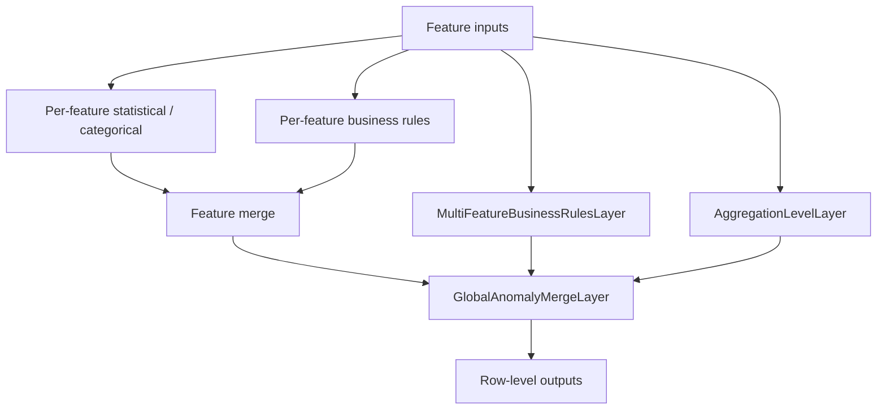

# FeatureSpaceAnomalyDetectionModel

## Overview

`FeatureSpaceAnomalyDetectionModel` is an end-to-end **tabular anomaly detection** model. For each feature it runs a statistical (or categorical) detector, optionally applies per-feature business rules, then merges branches. Optional **multi-feature rules** and **aggregation levels** add cross-feature logic. A final [`GlobalAnomalyMergeLayer`](../layers/global-anomaly-merge-layer.md) produces row-level `probability`, `score`, `is_anomaly`, and `reason`.

## How It Works



1. **Statistical branch**: `StatisticalNumericalAnomalyDetection` or `CategoricalAnomalyDetectionLayer`
2. **Business branch**: `BusinessRulesLayer` (or pass-through defaults)
3. **Optional**: multi-feature rules + aggregation levels
4. **Global merge**: max strategy across feature dictionaries

## Why Use / Use Cases

- Mixed numerical + categorical feature spaces
- Domain rules alongside statistical baselines
- Interpretable reasons per feature and globally
- Production `.keras` pipelines without a separate sklearn stack

Typical domains: quality control, pricing / catalog validation, IoT feature monitoring, fraud heuristics with explicit rules.

## Quick Start

```python
import keras
from kerasfactory.models import FeatureSpaceAnomalyDetectionModel

feature_space = {
    "temperature": "numerical",
    "color": "cat_string",
}
business_rules = {
    "temperature": [(">", 0), ("<", 100)],
    "color": [("in", ["red", "green", "blue"])],
}

model = FeatureSpaceAnomalyDetectionModel(
    feature_space=feature_space,
    numerical_threshold=2.0,
    numerical_method="z-score",
    business_rules=business_rules,
)

# After fitting / initializing numerical stats on training data:
predictions = model.predict(
    {
        "temperature": keras.ops.convert_to_tensor([[20.0], [150.0]]),
        "color": keras.ops.convert_to_tensor([["red"], ["purple"]]),
    }
)
```

## Advanced Usage

### Multi-feature Rules

```python
multi_feature_rules = {
    "winter_temp": {
        "features": ["season", "temperature"],
        "conditions": [
            {
                "when": {"season": "winter"},
                "require": {"temperature": [("<", 15.0)]},
            }
        ],
    }
}

model = FeatureSpaceAnomalyDetectionModel(
    feature_space={
        "season": "cat_string",
        "temperature": "numerical",
    },
    multi_feature_rules=multi_feature_rules,
)
```

### Aggregation Levels

```python
aggregation_levels = {
    "dimensions": {
        "features": ["length", "width"],
        "stats": {
            "aggregation_function": "mean",
            "threshold": 2.0,
        },
    }
}

model = FeatureSpaceAnomalyDetectionModel(
    feature_space={"length": "numerical", "width": "numerical"},
    aggregation_levels=aggregation_levels,
)
```

### Distribution Transforms

Pass `transformations={"feature": {"type": "...", "lambda": 0.0}}` to insert a `DistributionTransformLayer` before numerical scoring.

## Parameter Guide

| Parameter | Default | Description |
|-----------|---------|-------------|
| `feature_space` | required | Name → `"numerical"`, `"cat_string*"`, or `"cat_int*"` |
| `numerical_threshold` | `2.0` | Threshold for numerical statistical layers |
| `numerical_method` | `"z-score"` | `"z-score"`, `"iqr"`, or `"mad"` |
| `business_rules` | `{}` | Per-feature rule lists |
| `multi_feature_rules` | `{}` | Cross-feature when/require rules |
| `aggregation_levels` | `{}` | Level definitions (features / stats / rules) |
| `transformations` | `{}` | Optional distribution transforms |

## Testing

```bash
pytest tests/models/test__FeatureSpaceAnomalyDetectionModel.py -v
```

## Common Issues

| Issue | Fix |
|-------|-----|
| Unsupported feature type | Use `numerical` / `cat_string` / `cat_int` prefixes |
| Numerical scores flat | Ensure statistical layers are initialized from training stats (`fit` / `initialize_from_stats`) |
| Multi-feature errors | Declare every referenced feature in `feature_space` |
| Aggregation ownership | Each feature in at most one aggregation level |

## Related Layers / Models

- [StatisticalNumericalAnomalyDetection](../layers/statistical-numerical-anomaly-detection.md)
- [BusinessRulesLayer](../layers/business-rules-layer.md)
- [MultiFeatureBusinessRulesLayer](../layers/multi-feature-business-rules-layer.md)
- [AggregationLevelLayer](../layers/aggregation-level-layer.md)
- [GlobalAnomalyMergeLayer](../layers/global-anomaly-merge-layer.md)
- [StratifiedAnomalyDetectionModel](stratified-anomaly-detection-model.md)
- [KerasStratifiedAnomalyModel](keras-stratified-anomaly-model.md)

## API Reference

::: kerasfactory.models.FeatureSpaceAnomalyDetectionModel
