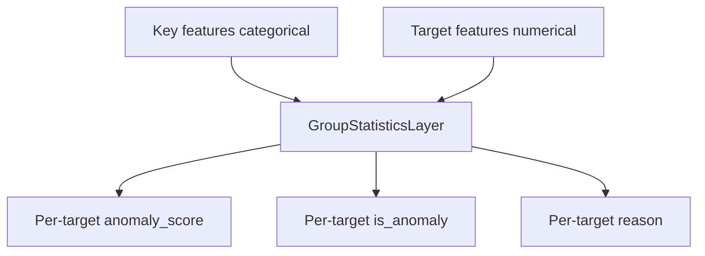

# KerasStratifiedAnomalyModel

## Overview

`KerasStratifiedAnomalyModel` is a **fully Keras** stratified anomaly model. It builds input layers for categorical **key features** and numerical **target features**, then scores targets with [`GroupStatisticsLayer`](../layers/group-statistics-layer.md) using online group mean/std and global fallback.

Designed for serializable inference (Keras 3 / serving-friendly) on raw tabular batches.

## How It Works



1. Generate a group config from `key_features` (joined name → keys + threshold)
2. On `training=True`, update Welford statistics
3. On inference, emit z-score based flags per target feature

## Why Use / Use Cases

- Cohort-aware anomaly detection without a separate FeatureSpace ensemble
- Streaming / batch training that updates stats in-graph
- Serving that expects named outputs like `sales_anomaly_score`

Use when “normal” depends on categorical context (region, store, SKU class).

## Quick Start

```python
import keras
from kerasfactory.models import KerasStratifiedAnomalyModel

model = KerasStratifiedAnomalyModel(
    feature_space={
        "region": "string",
        "sales": "float32",
        "inventory": "float32",
    },
    key_features=["region"],
    target_features=["sales", "inventory"],
    min_samples=5,
    threshold=3.0,
)

batch = {
    "region": keras.ops.convert_to_tensor([["north"], ["north"]], dtype="string"),
    "sales": keras.ops.convert_to_tensor([[100.0], [900.0]]),
    "inventory": keras.ops.convert_to_tensor([[50.0], [55.0]]),
}

_ = model(batch, training=True)
out = model(batch, training=False)
print(out["sales_anomaly_score"])
print(out["sales_is_anomaly"])
print(out["sales_reason"])
```

## Advanced Usage

### Fit Helpers / Reports

The model includes utilities for saving/loading and generating anomaly reports (see source for `save_model`, `load_model`, and reporting helpers). Prefer the model’s own save path for Serving compatibility.

### Threshold Tuning

```python
model = KerasStratifiedAnomalyModel(
    feature_space={"store": "string", "revenue": "float32"},
    key_features=["store"],
    target_features=["revenue"],
    threshold=2.5,  # more sensitive than 3-sigma
    min_samples=10,
)
```

## Parameter Guide

| Parameter | Default | Description |
|-----------|---------|-------------|
| `feature_space` | required | Feature → `"string"` or numeric dtype |
| `key_features` | required | Stratification categorical features |
| `target_features` | required | Numerical features to score |
| `min_samples` | `5` | Min samples before trusting group stats |
| `fallback_strategy` | `"global"` | Only `"global"` supported |
| `threshold` | `3.0` | Z-score cutoff |
| `name` | `"stratified_anomaly_model"` | Model name |

## Testing

```bash
pytest tests/models/test__KerasStratifiedAnomalyModel.py -v
```

## Common Issues

| Issue | Fix |
|-------|-----|
| Always global fallback | Collect ≥ `min_samples` with `training=True` |
| Shape issues | Prefer `(batch, 1)` inputs; model expands unbatched tensors |
| Missing keys | Include every `key_features` + `target_features` name |
| Confusing with StratifiedAnomalyDetectionModel | This model is in-graph Keras; the other fits per-group FeatureSpace models |

## Related Layers / Models

- [GroupStatisticsLayer](../layers/group-statistics-layer.md)
- [StratifiedAnomalyDetectionModel](stratified-anomaly-detection-model.md)
- [FeatureSpaceAnomalyDetectionModel](feature-space-anomaly-detection-model.md)
- [StatisticalNumericalAnomalyDetection](../layers/statistical-numerical-anomaly-detection.md)

## API Reference

::: kerasfactory.models.KerasStratifiedAnomalyModel
