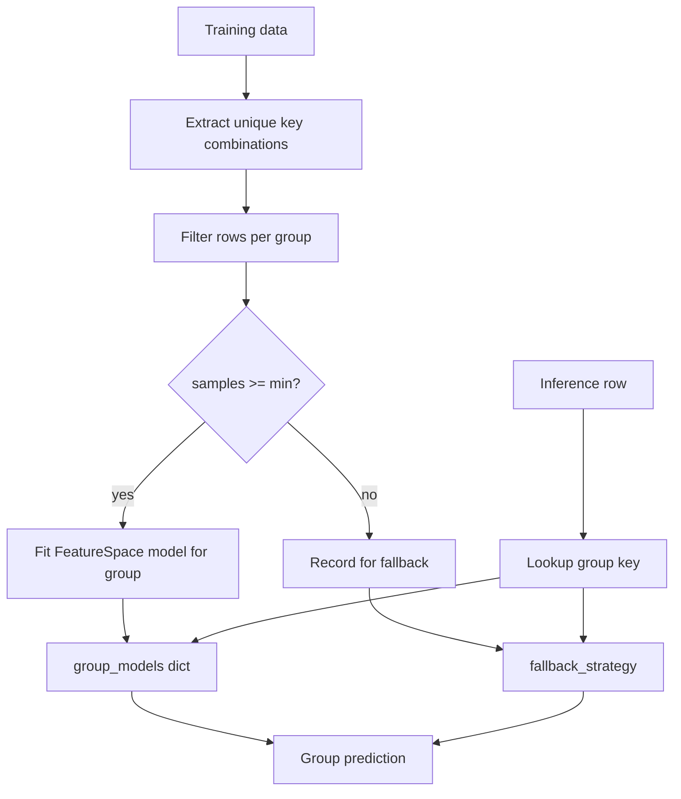

# StratifiedAnomalyDetectionModel

## Overview

`StratifiedAnomalyDetectionModel` builds a **separate** [`FeatureSpaceAnomalyDetectionModel`](feature-space-anomaly-detection-model.md) for each unique combination of stratification **keys** observed during `fit`. Target features are scored within each cohort; groups with too few samples use a configured **fallback strategy** (`global`, `nearest`, or `default`).

Use this when cohorts need full FeatureSpace behavior (business rules, multi-feature rules, IQR/MAD methods) rather than a single online `GroupStatisticsLayer`.

## How It Works



1. Validate `stratified_config` (`keys`, `targets`, `min_samples_per_group`, `fallback_strategy`)
2. During `fit`, create/store per-group FeatureSpace models + statistics
3. During predict, route each sample to its group model or fallback

## Why Use / Use Cases

- Different baselines per product × region × month
- Reuse FeatureSpace rules **inside** each stratum
- Explicit min-sample gating with multiple fallback options

Prefer [`KerasStratifiedAnomalyModel`](keras-stratified-anomaly-model.md) when you want a single serializable Keras graph with online Welford stats instead of many sub-models.

## Quick Start

```python
from kerasfactory.models import StratifiedAnomalyDetectionModel

feature_space = {
    "category": "cat_string",
    "month": "cat_string",
    "sales": "numerical",
}

stratified_config = {
    "keys": ["category", "month"],
    "targets": ["sales"],
    "min_samples_per_group": 20,
    "fallback_strategy": "global",
}

model = StratifiedAnomalyDetectionModel(
    feature_space=feature_space,
    stratified_config=stratified_config,
    numerical_method="z-score",
    numerical_threshold=2.0,
    business_rules={"sales": [(">", 0)]},
)

# model.fit(train_dict)  # builds group_models from unique key combos
# preds = model.predict(test_dict)
```

## Advanced Usage

### Fallback Strategies

| Strategy | Behavior |
|----------|----------|
| `global` | Use statistics / model trained on all data |
| `nearest` | Fall back to a nearest populated group |
| `default` | Use configured default group behavior |

### With Multi-feature Rules

```python
model = StratifiedAnomalyDetectionModel(
    feature_space={
        "store": "cat_string",
        "promo": "cat_string",
        "price": "numerical",
    },
    stratified_config={
        "keys": ["store"],
        "targets": ["price"],
        "min_samples_per_group": 10,
        "fallback_strategy": "global",
    },
    multi_feature_rules={
        "promo_price": {
            "features": ["promo", "price"],
            "conditions": [
                {
                    "when": {"promo": "clearance"},
                    "require": {"price": [("<", 50.0)]},
                }
            ],
        }
    },
)
```

## Parameter Guide

| Parameter | Default | Description |
|-----------|---------|-------------|
| `feature_space` | required | Feature type map |
| `stratified_config` | required | `keys`, `targets`, `min_samples_per_group`, `fallback_strategy` |
| `numerical_method` | `"z-score"` | Passed to per-group FeatureSpace models |
| `numerical_threshold` | `2.0` | Numerical anomaly threshold |
| `business_rules` | `{}` | Per-feature rules shared into group models |
| `multi_feature_rules` | `{}` | Cross-feature rules shared into group models |

## Testing

```bash
pytest tests/models/test__StratifiedAnomalyDetectionModel.py -v
```

## Common Issues

| Issue | Fix |
|-------|-----|
| Missing config key | Provide all four required `stratified_config` fields |
| Key not in feature_space | Add stratification keys to `feature_space` |
| Empty group models | Ensure training data covers key combinations with enough samples |
| Confusion with KerasStratifiedAnomalyModel | Ensemble of FeatureSpace models vs single GroupStatistics graph |

## Related Layers / Models

- [FeatureSpaceAnomalyDetectionModel](feature-space-anomaly-detection-model.md)
- [KerasStratifiedAnomalyModel](keras-stratified-anomaly-model.md)
- [GroupStatisticsLayer](../layers/group-statistics-layer.md)
- [MultiFeatureBusinessRulesLayer](../layers/multi-feature-business-rules-layer.md)

## API Reference

::: kerasfactory.models.StratifiedAnomalyDetectionModel
